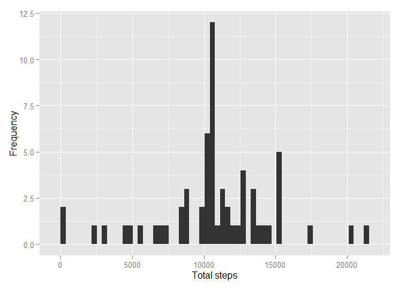
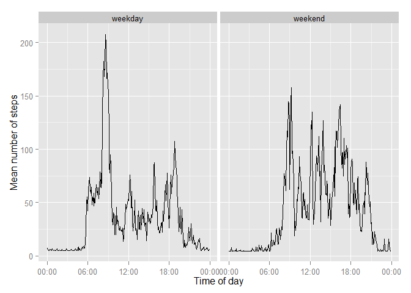

# Reproducible Research: Peer Assessment 1
John Schwertz  
January 18, 2014  

## Loading and preprocessing the data
Load csv data **activity.csv** and convert dates to **R Date class**  

```r
if(!file.exists('activity.csv')){
    unzip('activity.zip')
}
actdata <- read.csv("activity.csv")
actdata$date <- as.Date(actdata$date,"%Y-%m-%d")
head(actdata)
```

```
##   steps       date interval
## 1    NA 2012-10-01        0
## 2    NA 2012-10-01        5
## 3    NA 2012-10-01       10
## 4    NA 2012-10-01       15
## 5    NA 2012-10-01       20
## 6    NA 2012-10-01       25
```


## What is mean total number of steps taken per day?
First, calculate the mean number of steps for each day:

```r
total.steps <- tapply(actdata$steps, actdata$date, sum, na.rm=TRUE)
```

Let's look at the mean and median for the total steps per day:

```r
mean(total.steps)
```

```
## [1] 9354.23
```

```r
median(total.steps)
```

```
## [1] 10395
```

And let's take a look at the distribution of total number of steps per day with a histogram:

```r
library(ggplot2)
qplot(total.steps, xlab='Total steps', ylab='Frequency')
```

```
## stat_bin: binwidth defaulted to range/30. Use 'binwidth = x' to adjust this.
```

 


## What is the average daily activity pattern?

```r
library(ggplot2)
averages <- aggregate(x=list(steps=actdata$steps), by=list(interval=actdata$interval),
                      FUN=mean, na.rm=TRUE)
ggplot(data=averages, aes(x=interval, y=steps)) +
    geom_line() +
    xlab("5-minute interval") +
    ylab("average number of steps taken")
```

 

On average across all the days in the dataset, the 5-minute interval contains
the maximum number of steps?

```r
averages[which.max(averages$steps),]
```

```
##     interval    steps
## 104      835 206.1698
```

## Imputing missing values
Identify the number of intervals with missing step counts ("NA's"):

```r
t <- summary(actdata$steps)
t[7]
```

```
## NA's 
## 2304
```

```r
remove(t)
```

To fill in the missing values, I'll use mean steps for a five-minute interval for the entire dataset.

```r
library(Hmisc)
```

```
## Loading required package: grid
## Loading required package: lattice
## Loading required package: survival
## Loading required package: splines
## Loading required package: Formula
## 
## Attaching package: 'Hmisc'
## 
## The following objects are masked from 'package:base':
## 
##     format.pval, round.POSIXt, trunc.POSIXt, units
```

```r
actdata.imputed <- actdata
actdata.imputed$steps <- with(actdata.imputed, impute(steps, mean))
```

Let's compare the mean and median steps for each day between the original data set and the imputed data set.

```r
total.steps.imputed <- tapply(actdata.imputed$steps, 
                              actdata.imputed$date, sum)
mean(total.steps)
```

```
## [1] 9354.23
```

```r
mean(total.steps.imputed)
```

```
## [1] 10766.19
```

```r
median(total.steps)
```

```
## [1] 10395
```

```r
median(total.steps.imputed)
```

```
## [1] 10766.19
```

And a histogram of the imputed dataset.

```r
qplot(total.steps.imputed, xlab='Total steps', ylab='Frequency', 
      binwidth=359)
```

 

Imputing the missing data has increased the average number of steps. 

## Are there differences in activity patterns between weekdays and weekends?
Create a date.time column that combines the date and interval columns.

```r
time <- formatC(actdata.imputed$interval / 100, 2, format='f')
actdata.imputed$date.time <- as.POSIXct(paste(actdata.imputed$date, time),
                                 format='%Y-%m-%d %H.%M',
                                 tz='GMT')
```
For analyzing the means at the different times of day, it will also be convenient to have a time column. To do this, I convert all of the dates to be for today. since we only care about the time for that column.

```r
actdata.imputed$time <- format(actdata.imputed$date.time, format='%H:%M:%S')
actdata.imputed$time <- as.POSIXct(actdata.imputed$time, format='%H:%M:%S')
```

Add a factor column for whether a day is a weekday or weekend.

```r
day.type <- function(date) {
    if (weekdays(date) %in% c('Saturday', 'Sunday')) {
        return('weekend')
    } else {
        return('weekday')
    }
}

day.types <- sapply(actdata.imputed$date.time, day.type)
actdata.imputed$day.type <- as.factor(day.types)
```

Create a dataframe that holds the mean steps for weekdays and weekends.

```r
mean.steps <- tapply(actdata.imputed$steps, 
                     interaction(actdata.imputed$time,
                                 actdata.imputed$day.type),
                     mean, na.rm=TRUE)
day.type.pattern <- data.frame(time=as.POSIXct(names(mean.steps)),
                               mean.steps=mean.steps,
                               day.type=as.factor(c(rep('weekday', 288),
                                                   rep('weekend', 288))))
```

Now let's compare the patterns between weekdays and weekends.

```r
library(scales)
ggplot(day.type.pattern, aes(time, mean.steps)) + 
    geom_line() +
    xlab('Time of day') +
    ylab('Mean number of steps') +
    scale_x_datetime(labels=date_format(format='%H:%M')) +
    facet_grid(. ~ day.type)
```

 
